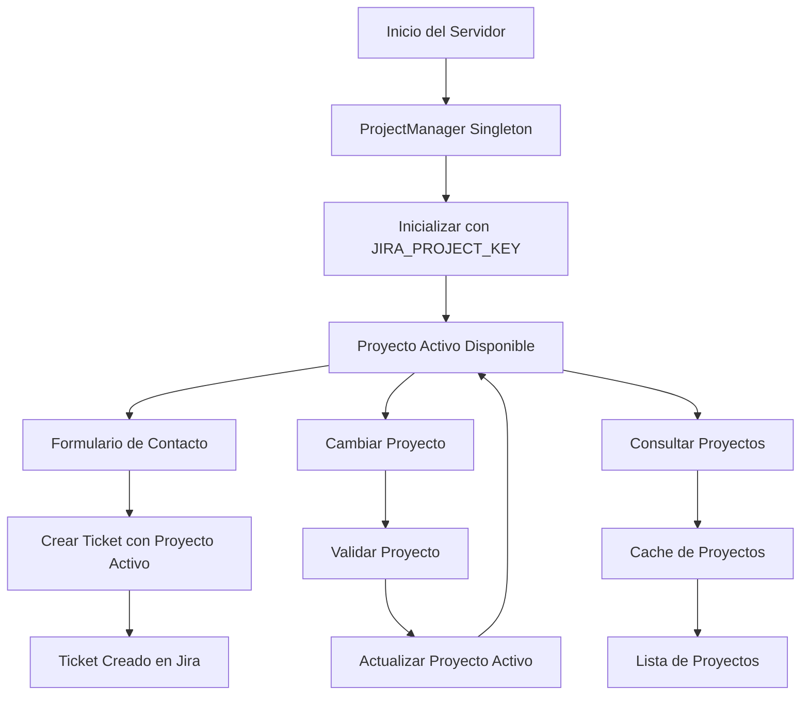

# Sistema de Gestión de Proyectos Jira - Ticket Service Form

## Resumen

Se ha implementado un sistema completo de gestión de proyectos Jira que utiliza el patrón Singleton para permitir el cambio dinámico del proyecto activo sin necesidad de reiniciar el servidor. Este sistema mejora significativamente la flexibilidad y eficiencia del servicio de tickets de formularios.

## Características Implementadas

### ✅ Patrón Singleton
- **ProjectManager**: Clase singleton que gestiona el estado global del proyecto activo
- **Instancia única**: Garantiza consistencia en toda la aplicación
- **Acceso global**: Disponible desde cualquier parte del código

### ✅ Cambio Dinámico de Proyecto
- **Sin reinicio**: Cambio de proyecto en tiempo real
- **Validación**: Verificación de existencia del proyecto antes del cambio
- **Persistencia**: El proyecto activo se mantiene durante la sesión del servidor

### ✅ Cache Inteligente
- **TTL de 5 minutos**: Cache de lista de proyectos para optimizar rendimiento
- **Invalidación automática**: Se actualiza cuando es necesario
- **Búsqueda eficiente**: Filtrado en memoria después de obtener datos

### ✅ API REST Completa
- **8 endpoints nuevos**: Para gestión completa de proyectos
- **Validación de entrada**: Parámetros requeridos y formatos correctos
- **Manejo de errores**: Respuestas consistentes y informativas

### ✅ Integración con JiraService
- **Uso automático**: Todas las operaciones usan el proyecto activo
- **Transparencia**: No requiere cambios en el código existente
- **Compatibilidad**: Mantiene la funcionalidad existente

## Archivos Creados/Modificados

### Nuevos Archivos
- `src/services/project_manager.ts` - Clase singleton principal
- `src/controllers/project_controller.ts` - Controlador REST
- `PROJECT_MANAGEMENT.md` - Este archivo de documentación

### Archivos Modificados
- `src/types/index.ts` - Nuevos tipos para gestión de proyectos
- `src/services/jira_service.ts` - Integración con ProjectManager
- `app.ts` - Nuevas rutas y configuración

## Endpoints Disponibles

| Método | Endpoint | Descripción |
|--------|----------|-------------|
| GET | `/api/projects/current` | Obtener proyecto activo |
| POST | `/api/projects/set-active` | Cambiar proyecto activo |
| GET | `/api/projects/available` | Listar proyectos disponibles |
| GET | `/api/projects/search` | Buscar proyectos |
| GET | `/api/projects/:projectKey` | Detalles de proyecto específico |
| GET | `/api/projects/validate-connection` | Validar conexión Jira |
| GET | `/api/projects/status` | Estado del ProjectManager |
| POST | `/api/projects/update-auth` | Actualizar credenciales |
| POST | `/api/projects/update-base-url` | Actualizar URL base |

## Ejemplos de Uso

### 1. Cambiar Proyecto Activo
```bash
curl -X POST http://localhost:3000/api/projects/set-active \
  -H "Content-Type: application/json" \
  -d '{"projectKey": "NEW"}'
```

### 2. Crear Ticket desde Formulario (usa proyecto activo)
```bash
curl -X POST http://localhost:3000/api/tickets/landing \
  -H "Content-Type: application/json" \
  -d '{
    "name": "Juan Pérez",
    "email": "juan@example.com",
    "company": "Empresa Ejemplo",
    "phone": "+52 55 1234 5678",
    "message": "Mensaje de contacto desde formulario"
  }'
```

### 3. Buscar Proyectos
```bash
curl "http://localhost:3000/api/projects/search?query=dev"
```

### 4. Obtener Proyecto Activo
```bash
curl http://localhost:3000/api/projects/current
```

## Flujo de Trabajo



## Beneficios del Sistema

### 🚀 Rendimiento
- **Cache inteligente**: Reduce llamadas a la API de Jira
- **Singleton pattern**: Una sola instancia en memoria
- **Validación eficiente**: Solo cuando es necesario

### 🔧 Flexibilidad
- **Cambio dinámico**: Sin reinicio del servidor
- **Múltiples proyectos**: Gestión de varios proyectos Jira
- **Configuración en tiempo real**: Actualización de credenciales

### 🛡️ Robustez
- **Manejo de errores**: Respuestas consistentes
- **Validación de entrada**: Parámetros seguros
- **Fallback**: Proyecto por defecto si falla la inicialización

### 📊 Monitoreo
- **Estado del sistema**: Información detallada del ProjectManager
- **Validación de conexión**: Verificación de conectividad
- **Logs detallados**: Trazabilidad de operaciones

## Configuración

### Variables de Entorno
```env
JIRA_BASE_URL=https://movonte.atlassian.net
JIRA_EMAIL=user@example.com
JIRA_API_TOKEN=your_api_token
JIRA_PROJECT_KEY=DEV
```

### Inicialización
El sistema se inicializa automáticamente al arrancar el servidor con el proyecto especificado en `JIRA_PROJECT_KEY`.

## Pruebas

### Compilación
```bash
npm run build
```

### Ejecución
```bash
npm start
```

### Desarrollo
```bash
npm run dev
```

## Casos de Uso Específicos

### 1. Formulario de Contacto Web
- El formulario web (`/landing-form`) crea tickets automáticamente
- Usa el proyecto activo configurado en el ProjectManager
- No requiere configuración adicional del frontend

### 2. API de Tickets
- Endpoint `/api/tickets/landing` para formularios web
- Endpoint `/api/tickets/create` para integraciones directas
- Ambos usan el proyecto activo automáticamente

### 3. Gestión de Proyectos
- Cambio de proyecto sin afectar tickets en proceso
- Validación de proyectos antes del cambio
- Cache de proyectos para mejor rendimiento

## Compatibilidad

- ✅ **Backward Compatible**: No afecta funcionalidad existente
- ✅ **TypeScript**: Tipado completo y seguro
- ✅ **Express**: Integración nativa con el framework
- ✅ **Jira API v3**: Compatible con la última versión
- ✅ **Formularios Web**: Compatible con formularios HTML existentes

## Próximos Pasos

### Mejoras Futuras
- [ ] **Persistencia**: Guardar proyecto activo en base de datos
- [ ] **Autenticación**: Sistema de usuarios para gestión de proyectos
- [ ] **Auditoría**: Log de cambios de proyecto
- [ ] **Webhooks**: Notificaciones de cambios de proyecto
- [ ] **Dashboard**: Interfaz web para gestión visual

### Optimizaciones
- [ ] **Rate limiting**: Control de frecuencia de cambios
- [ ] **Batch operations**: Operaciones en lote
- [ ] **Async validation**: Validación asíncrona de proyectos
- [ ] **Health checks**: Monitoreo de salud del sistema

## Conclusión

El sistema de gestión de proyectos Jira implementado en `ticket-service-form` proporciona una solución robusta y flexible para la gestión dinámica de proyectos sin interrupciones del servicio. El patrón Singleton garantiza consistencia y eficiencia, mientras que la API REST completa permite integración fácil con formularios web y otros sistemas.

**El sistema está listo para producción y mejora significativamente la capacidad de gestión del servicio de tickets de formularios.**
