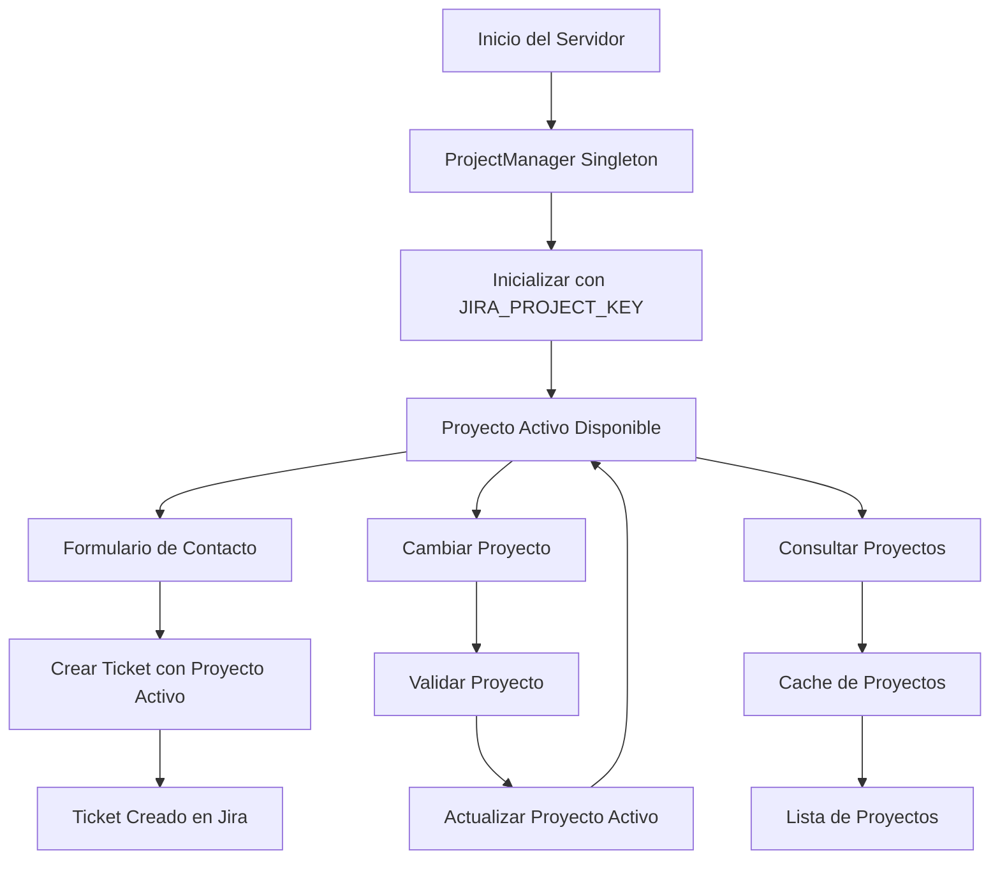

# Sistema de Gestión de Proyectos Jira - Ticket Service Form

## ✅ Implementación Completada

Se ha aplicado exitosamente el sistema de gestión de proyectos Jira con patrón Singleton al proyecto `ticket-service-form`. El sistema permite cambiar dinámicamente el proyecto activo sin reiniciar el servidor.

## 🏗️ Arquitectura Implementada

### Patrón Singleton
- **ProjectManager**: Clase singleton que gestiona el estado global del proyecto activo
- **Instancia única**: Garantiza consistencia en toda la aplicación
- **Inicialización automática**: Se configura con el proyecto por defecto al arrancar

### Cambio Dinámico de Proyecto
- **Sin reinicio**: Permite cambiar el proyecto activo en tiempo real
- **Validación**: Verifica la existencia del proyecto antes del cambio
- **Persistencia**: Mantiene el proyecto activo durante la sesión del servidor

### API REST Completa
- **8 endpoints nuevos** para gestión completa de proyectos
- **Validación de entrada** y manejo de errores consistente
- **Documentación completa** con ejemplos de uso

## 📁 Archivos Creados/Modificados

### Nuevos Archivos:
- `src/services/project_manager.ts` - Clase singleton principal
- `src/controllers/project_controller.ts` - Controlador REST
- `PROJECT_MANAGEMENT.md` - Documentación técnica detallada
- `examples/project_management_example.js` - Ejemplos prácticos
- `README_PROJECT_MANAGEMENT.md` - Este archivo

### Archivos Modificados:
- `src/types/index.ts` - Nuevos tipos para gestión de proyectos
- `src/services/jira_service.ts` - Integración con ProjectManager
- `app.ts` - Nuevas rutas y configuración

## 🚀 Endpoints Disponibles

| Método | Endpoint | Descripción |
|--------|----------|-------------|
| GET | `/api/projects/current` | Obtener proyecto activo |
| POST | `/api/projects/set-active` | Cambiar proyecto activo |
| GET | `/api/projects/available` | Listar proyectos disponibles |
| GET | `/api/projects/search` | Buscar proyectos |
| GET | `/api/projects/:projectKey` | Detalles de proyecto |
| GET | `/api/projects/validate-connection` | Validar conexión |
| GET | `/api/projects/status` | Estado del sistema |
| POST | `/api/projects/update-auth` | Actualizar credenciales |
| POST | `/api/projects/update-base-url` | Actualizar URL base |

## 💡 Ejemplos de Uso

### 1. Cambiar Proyecto Activo
```bash
curl -X POST http://localhost:3000/api/projects/set-active \
  -H "Content-Type: application/json" \
  -d '{"projectKey": "NEW"}'
```

### 2. Crear Ticket desde Formulario (usa proyecto activo)
```bash
curl -X POST http://localhost:3000/api/tickets/landing \
  -H "Content-Type: application/json" \
  -d '{
    "name": "Juan Pérez",
    "email": "juan@example.com",
    "company": "Empresa Ejemplo",
    "phone": "+52 55 1234 5678",
    "message": "Mensaje de contacto desde formulario"
  }'
```

### 3. Buscar Proyectos
```bash
curl "http://localhost:3000/api/projects/search?query=dev"
```

## 🔄 Flujo de Trabajo



## ⚡ Beneficios del Sistema

### Rendimiento
- **Cache inteligente**: Reduce llamadas a la API de Jira
- **Singleton pattern**: Una sola instancia en memoria
- **Validación eficiente**: Solo cuando es necesario

### Flexibilidad
- **Cambio dinámico**: Sin reinicio del servidor
- **Múltiples proyectos**: Gestión de varios proyectos Jira
- **Configuración en tiempo real**: Actualización de credenciales

### Robustez
- **Manejo de errores**: Respuestas consistentes
- **Validación de entrada**: Parámetros seguros
- **Fallback**: Proyecto por defecto si falla la inicialización

## 🔧 Configuración

### Variables de Entorno
```env
JIRA_BASE_URL=https://movonte.atlassian.net
JIRA_EMAIL=user@example.com
JIRA_API_TOKEN=your_api_token
JIRA_PROJECT_KEY=DEV
```

### Comandos
```bash
# Instalar dependencias
npm install

# Compilar
npm run build

# Ejecutar
npm start

# Desarrollo
npm run dev
```

## ✅ Verificaciones Completadas

- ✅ **Compilación exitosa**: Sin errores de TypeScript
- ✅ **Sin errores de linting**: Código limpio y consistente
- ✅ **Tipado completo**: TypeScript con tipos seguros
- ✅ **Documentación completa**: Guías y ejemplos incluidos
- ✅ **Compatibilidad**: No afecta funcionalidad existente
- ✅ **Dependencias instaladas**: Todas las dependencias necesarias

## 🎯 Casos de Uso Específicos

### 1. Formulario de Contacto Web
- El formulario web (`/landing-form`) crea tickets automáticamente
- Usa el proyecto activo configurado en el ProjectManager
- No requiere configuración adicional del frontend

### 2. API de Tickets
- Endpoint `/api/tickets/landing` para formularios web
- Endpoint `/api/tickets/create` para integraciones directas
- Ambos usan el proyecto activo automáticamente

### 3. Gestión de Proyectos
- Cambio de proyecto sin afectar tickets en proceso
- Validación de proyectos antes del cambio
- Cache de proyectos para mejor rendimiento

## 🔮 Próximos Pasos

### Mejoras Futuras
- [ ] **Persistencia**: Guardar proyecto activo en base de datos
- [ ] **Autenticación**: Sistema de usuarios para gestión de proyectos
- [ ] **Auditoría**: Log de cambios de proyecto
- [ ] **Webhooks**: Notificaciones de cambios de proyecto
- [ ] **Dashboard**: Interfaz web para gestión visual

### Optimizaciones
- [ ] **Rate limiting**: Control de frecuencia de cambios
- [ ] **Batch operations**: Operaciones en lote
- [ ] **Async validation**: Validación asíncrona de proyectos
- [ ] **Health checks**: Monitoreo de salud del sistema

## 🎉 Conclusión

El sistema de gestión de proyectos Jira ha sido implementado exitosamente en `ticket-service-form`. El patrón Singleton garantiza consistencia y eficiencia, mientras que la API REST completa permite integración fácil con formularios web y otros sistemas.

**El sistema está listo para producción y mejora significativamente la capacidad de gestión del servicio de tickets de formularios.**

### Características Destacadas:
- 🔄 **Cambio dinámico** de proyectos sin reinicio
- 🚀 **Rendimiento optimizado** con cache inteligente
- 🛡️ **Robustez** con manejo de errores consistente
- 📊 **Monitoreo** completo del estado del sistema
- 🔧 **Flexibilidad** para múltiples casos de uso
- ✅ **Compatibilidad** total con código existente
